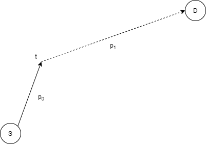
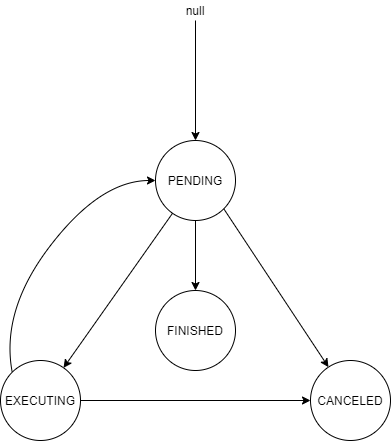

# Commanding RTS Commands
Scaling State Mutations via FSM Visitors

_DownFlux is a real-time strategy game in active development at
[github.com/downflux](https://github.com/downflux). The goal of this project is
simply to learn and have fun. I have several years of professional software
development experience, none of which is in the game industry. This document
does not advocate a general form solution for all state mutation problems, but
rather demonstrates a different view of the command pattern. For a more
technical and detailed overview of this approach, take a look at the [design
doc](https://blog.downflux.com/2021/01/13/arbitrary-command-execution/)._

_I mix first person plural in this document liberally because it sounds awkward
to keep saying "I" all the time, not because I'm royalty._

## Abstract

A major problem we're facing while working on DownFlux has been finding a
scalable approach to state mutations. Scalability here represents the ability
for us to remain agile when implementing new mutation flows -- this encompasses
general good software development guidelines like testability, code "fragrance"
(i.e. lack of smell), and framework flexibility.

Our model of a mutation flow consists of a command scheduler object, housing a
metadata object per distinct flow invocation. These metadata objects are a thin
wrapper around a finite state machine (FSM), and exposes a minimal subset of the
game state to a visitor object.

Our metadata objects may only call read-only queries to the game state, and
returns a calculated state to the visitor. The visitor may invoke write
operations on both the metadata and the underlying state.

See a snapshot of our
[repo](https://github.com/downflux/game/tree/8fbaefebcb31d5f59796c6285595ccda544dc02f)
for more details. Feel free to reach out on
[Reddit](https://reddit.com/r/downflux) or
[Twitter](https://twitter.com/downfluxgame) with questions or comments.

## Jargon

* state mutations, flows, commands: a series of changes to the game state (e.g.
  map, entities, etc.) which achieve a specific end-goal (e.g. `move`)

### Flow Examples

* `move(source, dest)`: move the source object to the destination location.
* `chase(source, target)`: series of serialized moves, which are updated as the
  destination object moves.
* `attack(source, target)`: chase target asynchronously; if target is within
  attack range and the source can attack (off cooldown), then commit state
  change.

## An ad hoc Approach

The first attempt we made at implementing a state mutation "framework" skipped
any consideration of scalability or maintainability for the sake of an MVP. Here
is our single `move` command:

```golang
func (s *Server) doTick() {
  for {
    for c := range s.Commands() {
      // Client calls mutate this CommandQueue object by appending
      // pending commands.
      c.Execute(s.q[c.Type()])
    }
  }
}

type Command interface {
  Execute(args interface{}) error
  Type() CommandType
}

func (c *MoveCommand) Execute(args interface{}) error {
  a = args.(MoveCommandArg)

  // p is a list of Position objects (i.e. (x, y) tuples).
  p = c.map.GetPath(a.Source.Location.Get(a.Tick), a.Destination)

  // Source merges the positions with internal velocity in
  // the curve.
  a.Source.Location.Update(p)
  return nil
}
```

<a name="figure-1"></a>Figure 1: Simple implementation of the `move` command.

Yup. This moves things. How do we start overengineer this?

Our second order approximation takes into consideration `GetPath` is expensive
-- we're making a full A* search. But in an RTS game, it is very often the case
that the player direct units to a different location before the unit reaches the
target, wasting a lot of compute cycles.[^1] Therefore, we want to calculate and
set a partial trajectory instead, with delayed execution of the rest of the
path.[^2]



<a name="figure-2"></a>Figure 2: Partial path diagram. The command should only
calculate p<sub>0</sub> first; at some time t in the future, recalculate the
path (which may involve further sub-path iterations).

With the partial path logic, our command now looks something like this:[^3]

```golang
func (s *Server) doTick() {
  for var args := range s.q {
    c.Execute(curTick, args)
  }
}

// Called by client API as well as internally.
func (c *MoveCommand) Schedule(
  t Tick,
  e Entity,
  d Destination) error {

  scheduledAction := c.q.Get(e)
  if scheduledAction != nil && scheduledAction.Precedence(t) {
    c.q.Set(t, e, d)
  }
}

func (c *MoveCommand) Execute(t Tick, args interface{}) {
  const pathLen int = 10;
  var arg := args.(MoveCommandArg)

  // Return a path of a specific length instead.
  p = c.Map.GetPath(
    arg.Source.Location.Get(t),
    arg.Destination,
    pathLen,
  )

  arg.Source.Location.Update(p)

  // Schedule partial path execution if the last element of the path is not
  // the "true" destination. c.Schedule() also needs to calculate if there are
  // any existing commands that need to be overwritten.
  if p[len(p) - 1] != arg.Destination {
    c.Schedule(
      t + a.Source.CalculateTravelTime(p),
      arg.Source,
      arg.Destination)
  } else {
    c.Delete(arg)
  }
}
```

<a name="figure-3"></a>Figure 3: Toy `move` command implementation v2 -- here we
enqueue a delayed move command into the main queue. This queue may have client-
or other server-initiated command scheduling, so when we update the queue, we
need to ensure there is a single, canonical execution flow; this logic is packed
into the `Schedule()` function, meaning **a single command will need to know the
implementation logic / hierarchy of all other commands**.

Kind of a pain, but still doable.

This model worked well enough for us to get a rudimentary frontend client
running; however, a gut check seems to indicate major scalability issues with
this approach.[^4] In particular,

1. A command may act on multiple entity types, and an entity may have multiple
  mutation flows -- the implementations so far already demonstrates this
  vulnerability IMO.
1. Because the command queue contains commands from all command implementations
  (i.e. `move`, `attack`, etc.) and the command may mutate the queue (e.g.
  partial move enqueues), the command must know the details of all siblings
  flows.
1. The command must manually check the global state each time it is invoked, e.g.
  if the source has reached the destination. It is unclear how each command will
  implement this state read, which will impede maintainability.
1. `Command.Execute()` read and writes to the global state; from our simple move
  example, this already seems like a testability nightmare and needs to be
  addressed.

A common theme to these issues is the broad scope and authority we have
conferred upon the command object; how can we clamp down on this?

## (An Accidental) Tour de Entities

The first concern seems like a classic double dispatcher problem between the
command and the entities (e.g. tanks) that they mutate. This seems to suggest we
should break out the command into a
[visitor pattern](https://en.wikipedia.org/wiki/Visitor_pattern) implementation.

```golang
func (s *Server) doTick() {
  for var v := range s.Commands() {
    for var e := range s.Entities {
      e.Accept(v)
    }
  }
}

func (e *EntityImpl) Accept(v Visitor) { v.Visit(e) }

func (c *MoveCommand) Visit(e Entity) {
    if !e.IsMoveable() { return }

    if c.q.Has(e) {
      // This is the same implementation as in [Figure 3](#figure-3).
      c.Execute(c.Status.CurrentTick(), ...)
    }
}
```

<a name="figure-4"></a>Figure 4: The architectural change counterpart to the
changes made in [Figure 3](#figure-3).

There are some flaws here.

1. The `Acceptor` object is a single game entity -- this is not abstract enough.
  Consider the `attack` command which mutates both the attacker and target --
  how do we visit target in an `AttackCommand`? Do we need a
  `DealDamageVisitor`? If so, suggests we will need a message broker between
  attacking and taking damage, which seems unnecessarily overwrought.
1. The command still has to deal with the schedule (`c.q`), which is a _global
  mutatable state_. As mentioned in [Figure 2](#figure-2), the schedule may be
  edited by both sides of the network divide, and having our command dealing
  with that logic directly seems messy.

Note that **this refactor was actually useless in terms of reducing tech debt**,
but was very important in exposing the points of friction that we will need to
address.

## Finite State Metadata

Let's examine the first concern above, where we're dealing with pain points
brought up by iterating over the entities themselves in a command. Because we're
visiting the entity, that means any broader details about the execution
(including e.g. partial move cached data) still need to be managed by the
command object:

```golang
type MoveCommand struct {
  // Reference to global state.
  q []MoveCommandArg
  ...
}

func (c *MoveCommand) Visit(e Entity) {
  if c.q.Has(e, ...) { ... }  // See [Figure 4](#figure-4)
  ...
}
```

This seems inefficient -- why are we accepting a non-scheduled entity as valid
input? In fact, our first approach was probably closer to the mark -- let's just
pass the command metadata as input instead!

```golang
func (c *MoveCommand) Visit(m MoveCommandArg) { ... }
```

One key difference between this and our initial implementation is how we're
approaching the metadata object here -- we're promoting the metadata into a
"real" data struct, and as such, we need to consider the exported metadata API.
What does a command need from the metadata?

In the case of `move` (with partial implementation), we need to track when the
next iteration of partial paths need to be calculated. Seems like a job for an
FSM!

```golang
type CommandMetadata interface {
  Status() FSMState
  Transitions() map[FSMState]FSMState

  // Used to determine which command needs to be canceled.
  Precedence(o CommandMetadata) bool

  // Triggered by Schedule or a Command.
  Cancel()
}

// MoveCommandArg will implement the CommandMetadata interface.
type MoveCommandArg struct {
  scheduledTick Tick
  source        Moveable
  destination   Position
}
```

<a name="figure-5"></a>Figure 5: Expanded `MoveCommandArg` type from
[Figure 1](#figure-1).

Where the FSM DAG for `MoveCommandArg` is as follow:



<a name="figure-6"></a>Figure 6: `move` state diagram.

The most straightforward way to link this into `MoveCommand.Visit()` looks
something like this:

```golang
func (c *MoveCommand) Visit(m *MoveCommandArg) {
  if m.Tick() == curTick {
    m.SetStatusOrDie(EXECUTING)
  }
  if m.Status() == EXECUTING {
    p = c.Map.GetPath(..., pathLen)
    ...

    // Need to schedule next iteration.
    if m.Destination() != p[len(p) - 1] {
      m.SetTick(...)
      m.SetStatusOrDie(PENDING)
    }  
  }
  if m.Source().Location(curTick) == m.Destination() {
    m.SetStatusOrDie(FINISHED)
  }
}
```

<a name="figure-7"></a>Figure 7: `move` implementation with partial paths and
FSM metadata inputs.

This seems cleaner than what we had before! We have a formal FSM structure
validating the partial command action being executed. Additionally, because
we're passing a reference to the metadata object into `Visit()`, we can migrate
the schedule away from the command.

This still seems a bit messy though, when we have to call `SetStatusOrDie` so
many times. Is there a way we can not do that?

(Yes.)

### Read-Only FSMs

We observe that the state of an FSM is an explicit representation of the
underlying system. _It does not matter how we calculate this state!_ In
[Figure 7](#figure-7), we "calculated" the state by storing it as an internal
variable via `SetStatusOrDie()`, but we can also _treat the state as a generic
read-only operation on the system_.

As an example, let's consider the state diagram of the `move` command:[^5]

* `FINISHED`: A `move` command is finished if the source entity has arrived at
  the given destination.
* `PENDING`: If the internal `m.scheduledTick` does not equal the current tick,
  the command is not yet ready to execute; this accounts for both when the
  source is already moving, or still needs to calculate the next partial move.
* `EXECUTING`: If `m.ScheduledTick` equals current game tick, the command needs
  to take action and actually calculate the path of the object. At the end of
  the execution phase, the scheduled tick should be updated.
* `CANCELED`:[^6] An externally triggered transition if e.g. the client
  specifies another move command in the meantime. This may need to be explicitly
  set.

So in code form, this looks something like this:

```golang
// MoveCommandArg will implement the CommandMetadata interface.
type MoveCommandArg struct {
  scheduledTick Tick
  isCanceled    bool

  // References the actual game state.
  status        *TickStatus  // Exports CurrentTick().
  source        Moveable
  destination   Position
}

func (m *MoveCommandArg) Status() FSMStatus {
  if m.isCanceled == CANCELED { return CANCELED }
  if m.source.Location.Get(m.status.CurrentTick()) == m.destination {
    return FINISHED
  }
  if m.scheduledTick == status.CurrentTick() {
    return EXECUTING
  }
  return PENDING
}

func (c *MoveCommand) Visit(m MoveCommandArg) {
  if m.Status() == EXECUTING {
    ...
    m.SetScheduledTick(...)
  }
}
```

<a name="figure-8"></a>Figure 8: Toy implementation of the `move` command with
smart metadata objects.

By making the metadata a bit smarter, we've greatly reduced the burden on the
execution logic. Note that the metadata object itself is **read-only** -- we are
ensuring that only the command object has the ability to write to the game
state, as well as to the metadata object (e.g. `SetScheduledTick()`). Our server
tick logic currently looks like this:

```golang
func (s *Server) doTick() {
  for var v := range s.Visitors() {
    for var q := range s.q[v.Type()] {
      // It is up to each metadata list to decide if it may be run in parallel
      // or not.
      q.Accept(v)
    }
  }
}
```

To pause a second, here is what our infrastructure looks like at the moment:


<a name="figure-9"></a> Figure 9: FSM / Visitor relationship diagram. The dirty
state component is outside the scope of this blog post, but is explained in the
[design doc](https://blog.downflux.com/2021/01/13/arbitrary-command-execution/).

## Two-Pass Scheduler

The other friction point we had was with regards to the complexity of having the
command pushing into a two-way schedule (i.e., one that is directly mutated by
both the client and server). We need a way to control the timing of when
schedule mutations are made.

Our solution to this problem was to implement a client-only schedule object
which is used as a scratchpad for incoming requests. At the beginning of each
tick, we merge this into our actual source-of-truth schedule:

```golang
type Schedule interface {
  Append(t VisitorType, m CommandMetadata)
  RemoveCanceledAndFinished()

  // Requires CommandMetadata to implement Precedence().
  Merge(o Schedule)
}

func (s *Server) doTick() {
  s.q.RemoveCanceledAndFinished()
  s.q.Merge(s.clientSchedule)

  for var v := range s.Visitors() { ... }
}
```

<a name="figure-10"></a>Figure 10: Two-pass schedule implementation.

This ensures when commands are running, the command has exclusive write access
to the schedule -- since only instances of the same command are executing at the
same time, reasoning about concurrency becomes greatly simplified.

## Conclusions

An interesting tangent: a core application of the visitor pattern is for a
double-dispatch table; however, note that we have a strict one-to-one
relationship between a single `CommandMetadata` implementation and a command.
There is no double dispatch here.

However, the _reason_ why a visitor pattern is good when solving for the
double-dispatch is because it forces a decoupling of the underlying data object
from the mutations. It is our good fortune that we chose to view the problem
through this lens, even if we originally applied the pattern inappropriately.

If we wished, we can migrate back to using a simple for loop to call the
commands, as we originally did, but safe in the knowledge that we have arrived
at a scalable approach to building state mutation flows.

```golang
func (s *Server) doTick() {
  ...
  for var c := range s.Commands() {
    for var m := range s.q[c.GetType()] {
      // If the command wants to run serially, it may employ a class-level lock
      // on Execute().
      go c.Execute(m)
    }
    // Wait for all invocations to return before continuing to next command.
    ...
  }
}
```

### Chaining Commands

Let's apply the same pattern to the `attack` command, a flow which has a
dependent `chase` action.

```golang
type AttackMetadata struct {
  s     CanAttack
  t     CanDie  // Mortal?
  chase *ChaseMetadata
}

func (m *AttackMetadata) Status() Status {
  if chase.Status() == CANCELED { return CANCELED }
  if t.Health(curTick) <= 0 {
    return FINISHED  // Cleaned up next tick.
  }
  if d(s, t) < s.AttackRange() && a.OffCooldown(curTick) {
    return EXECUTING
  }
  return PENDING
}

func (c *AttackCommand) Visit(m AttackMetadata) {
  if m.Status() == EXECUTING {
    t.Damage(a.Strength())
  }
}
```

<a name="figure-11"></a>Figure 11: Simplified `attack` command implementation.[^7]

Dependencies in our framework are modeled by a pointer in the metadata to
another metadata object; the encompassing flow can then incorporate the
dependent flow status when reporting its own status. We have yet to encounter a
case where the command needs to query a dependent step's status direcly.

A command may need to enqueue a dependent flow. For example, consider an entity
commanded to guard an area -- when an enemy enters the entity's line of sight,
`guard` may decide to enqueue an `attack`. In this case, the `guard` command
will have a reference to the `attack` schedule and call `q.Append()`.

### Canceling Commands

`q.Append()` and `q.Merge()` will invoke `CommandMetadata.Precedence()`, which
tests for the relative priority of two metadata objects. The lower priority one
will be canceled.

`CommandMetadata.Cancel()` is command-dependent, but should also trigger the
`Cancel()` function of dependencies. An upstream / parent command which need the
child finish can then query the child flow status when reporting its own
`Status()`.

## See Also

* [Arbitrary Command Execution](https://docs.downflux.com/design/fsm.html)
  Technical design doc of this approach that goes deeper into implementation
  specifics.
* [Time-Invariant Finite State Machines](https://blog.kevmo314.com/time-invariant-finite-state-machines.html)

## Addendum

### Recontextualizing as Event Flows

I came across a rather interesting tech talk while writing this article which
talks about the
[Event-carried State Transfer](https://youtu.be/STKCRSUsyP0?t=896) software
pattern (indeed, from what little research I've done on this, it seems like this
talk is actually _the_ talk which introduced the concept to the wider public).

There are some interesting parallels here between the event-driven approach
described and ours here. Indeed, the state query in the command executor is just
detecting if an event occurred between the last and current server tick.
Moreover, the event-carried state transfer pattern seems to emphasize
**minimizing data access to the underlying state**. The event pattern achieves
this through some level of caching, packed into the event data in order to
reduce resource contention. Our implementatino instead minimizes the API surface
area that is exposed through the command metadata.

It is true that we could massage our current approach into an event-driven
approach; however, this seems both overengineered and antithetical to how we
view our code.

1. Remember that we are treating the game system as deterministic. When an
  object moves, the partial move schedule is already preordained -- there is no
  additional user input that is necessary in order to make the system behave
  correctly. Our framework accounts for this by doing a series of state reads.
  However, if we were to transform the state transitions into broadcasted
  events, we're asserting instead the system is always in flux, and we're
  "promoting" deterministic behavior into the category of "unexpected" inputs.
  This seems like a less elegant approach, and at the same time will require a
  large system overhaul for questionable value (for our use-case).
1. A single server tick will execute a list of commands in a known order, e.g.
  we process all `move` commands, then all `attack` commands, etc. Event queues
  are very useful when we are decoupling execution _order_ from our server;
  however, if we were to do this, then a whole new, scary world of consistency
  problems appear. We can leave that problem to concurrent text editors and
  CRDTs.

### <a name="a-digression-on-attack-variants"></a>A Digression on Attack Variants

While editing this document, a [friend](https://www.jonkimbel.com) pointed out
the toy implementation of the `attack` command does not fully specify some
edge-case behavior --

> I know you said this is simplified, but how do you handle situations where the
> command calls for a stationary source (e.g.
> [tesla coil](https://cnc.fandom.com/wiki/Tesla_coil_(Red_Alert_2))) to attack
> a target which then leaves its range?
> 
> Does it stay in the command queue in case the target comes back into range,
> with some lower-priority "auto attack" command dealing damage to nearby
> enemies in the meantime? Or does it cancel itself?

This question demonstrates a nice property of the FSM / visitor approach, which
is the flexibility of implementation. The implementation in
[Figure 11](#figure-11) assumes that the target can move, and will always try to
attack the same target until the target dies. How do we extend this command?

We can envision an `attack` variant that forgets the target after the target
goes out of range:

```golang
type ForgetfulAttackMetadata struct {
  s           CanAttack
  t           CanDie
  hasAttacked bool
}

func (m *ForgetfulAttackMetadata) Status() Status {
  if t.Health(curTick) <= 0 {
    return FINISHED  // Cleaned up next tick.
  }
  if d(s, t) < s.AttackRange() && a.OffCooldown(curTick) {
    return EXECUTING
  }
  if m.hasAttacked && d(s, t) >= s.AttackRange() {
    return CANCELED  // Cleaned up next tick.
  }

  return PENDING
}

func (c *ForgetfulAttackCommand) Visit(m ForgetfulAttackMetadata) {
  if m.Status() == EXECUTING {
    t.Damage(a.Strength())
    m.SetHasAttacked()
  }
}
```

<a name="figure-12"></a>Figure 12: Alternative `attack` command implementation.
Which cancels itself if the target exits range via a read-only operation.

### Partial Tick Execution

Because the metadata is stored in a separate queue, we can pause visitor
execution at any given time during a tick -- this means we can smooth out large
server loads over several ticks, allowing us to enforce a consistent server tick
rate (at the expense of some additional end-to-end latency). This feature is not
currently implemented in our game yet, pending load testing.

## Notes

[^1]: Partial pathfinding is implemented via
    [hierarchical A*](https://webdocs.cs.ualberta.ca/~mmueller/ps/hpastar.pdf),
    though this may / will change in the future. The point is that there may be
    additional complexity introduced into commands. As an interesting sidenote,
    partial pathfinding allows us to spread out pathfinding to multiple workers
    after the initial coarse-grain search. This may be a nice optimization route
    to go down in the future.

[^2]: Future implementations of pathfinding, e.g. via flow fields or
    navmesh-based solutions, may eliminate the need for partial paths.

[^3]: In reality, this step was implemented along with initial visitor pattern
    migration (explained later), but we're highlighting a rather important
    motivating point for seeking better approaches to the problem.

[^4]: While `interface{}` inputs are undesirable, they aren't necessarily an
    _architectural_ problem. We're concerned with what are potential
    project-terminators due to non-maintainability.

[^5]: For more information on this, see
    [Time-Invariant Finite State Machines](https://blog.kevmo314.com/time-invariant-finite-state-machines.html).
    State transitions are traditionally triggered by an "external" user; we are
    expanding the FSM here to allow for the possibility that transitions may be
    triggered without an explicit outside trigger action. This allowance gives
    us a lot of flexibility in modeling semi-autonomous commands.

[^6]: Sidenote, I learned the objectively better "cancelled" spelling is
    British, and so have reverted to the inferior but semantically consistent
    American spelling.

[^7]: For a more in-depth discussion of the `attack` command
    implementation details, see
    [A Digression on Attack Variants](#a-digression-on-attack-variants)
