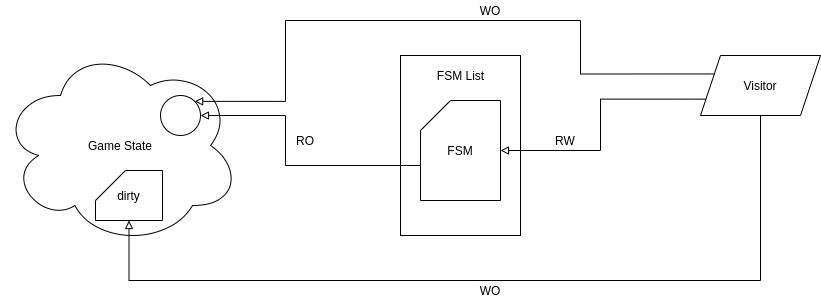
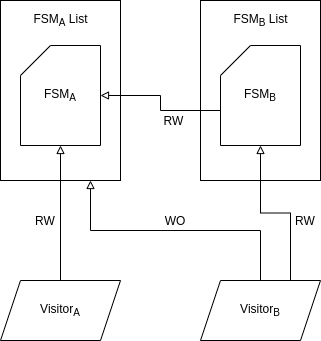
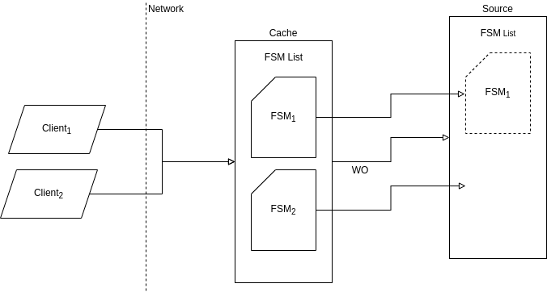

<!-- Copy and paste the converted output. -->

<!-----
NEW: Check the "Suppress top comment" option to remove this info from the output.

Conversion time: 2.458 seconds.


Using this Markdown file:

1. Paste this output into your source file.
2. See the notes and action items below regarding this conversion run.
3. Check the rendered output (headings, lists, code blocks, tables) for proper
   formatting and use a linkchecker before you publish this page.

Conversion notes:

* Docs to Markdown version 1.0β29
* Tue Jan 12 2021 23:33:22 GMT-0800 (PST)
* Source doc: Arbitrary Command Execution
* Tables are currently converted to HTML tables.
* This document has images: check for >>>>>  gd2md-html alert:  inline image link in generated source and store images to your server. NOTE: Images in exported zip file from Google Docs may not appear in  the same order as they do in your doc. Please check the images!

----->


<p style="color: red; font-weight: bold">>>>>>  gd2md-html alert:  ERRORs: 0; WARNINGs: 0; ALERTS: 3.</p>
<ul style="color: red; font-weight: bold"><li>See top comment block for details on ERRORs and WARNINGs. <li>In the converted Markdown or HTML, search for inline alerts that start with >>>>>  gd2md-html alert:  for specific instances that need correction.</ul>

<p style="color: red; font-weight: bold">Links to alert messages:</p><a href="#gdcalert1">alert1</a>
<a href="#gdcalert2">alert2</a>
<a href="#gdcalert3">alert3</a>

<p style="color: red; font-weight: bold">>>>>> PLEASE check and correct alert issues and delete this message and the inline alerts.<hr></p>

# Arbitrary Command Execution
Scaling Complex Flows with FSM Metadata

| Status         | final                      |
| :------------- | :------------------------- |
| Author(s)      | minke.zhang@gmail.com      |
| Contributor(s) | bleh777777777777@gmail.com |
| Last Updated   | 2021-01-12                 |

## Background

DownFlux is a real-time strategy game which potentially requires a wide
variety of state-mutating flows. Because both the state and the flows are
complex, we need a formal framework to describe the work that needs to be done
to change the state. In a world where we add ad hoc state mutations, we will
very quickly see the pains of a complex chain of code without a clear debug
entry point.

## Overview

We will break any given state mutation into two parts -- a command metadata
object, and a command executor. The metadata describes the overall command,
exposes a specific subset of the game state, and tracks the work that is
currently being done and will need to be done. The metadata may hold a
reference to a child command metadata struct as well.

On every game tick, the executor object queries the metadata for what work (if
any) needs to be done. The metadata queries only its internal references --
notably, this is a read-only operation; the metadata object does not have
authority to mutate state on its own. If the metadata signals to the executor
that work needs to be done, the excutor will then explicitly mutate both the
game and metadata object as appropriate.

## Detailed Design

### Components



<a name="figure-1">Figure 1</a>: FSM / Visitor relationship diagram.

#### Game State

The game state represents the totality of game data. This state may include
game entities e.g. tank instances, the curves representing an entity property
over time, as well as any other general data e.g. server status, the current
game tick, etc.

A subset of the game state is broadcast per tick to all connected clients.

#### FSM (Command Metadata)

A command is represented with a finite state machine with a fully defined
transition graph. For example, the move command consists of the `PENDING`,
`EXECUTING`, `FINISHED`, and `CANCELED` states, with transitions

```
PENDING → EXECUTING
PENDING → FINISHED
PENDING → CANCELED
```

This command will have references to the underlying game state as part of the
data struct, e.g.

```
type MoveCommand struct {
  serverStatus        *Status
  positionCurve       Curve
  nextPartialMoveTick float64
}
```

The command may offer a set of utility functions to mutate the referenced
subset of the game state, or its own internal state
(e.g. `nextPartialMoveTick`), but _must not mutate itself_. The command manager
must manually make the mutations.

##### Virtual State Transitions

The command metadata will be used to calculate the "real" state of the command
at any given point in time -- if we schedule a move command to occur ten ticks
in the future, we want to make sure the command itself knows when it needs to
execute. This alleviates processing logic that otherwise will need to be
handled by the iterator examining the commands (which in our case is the move
visitor).

See
[Time Invariant Finite State Machines](https://blog.kevmo314.com/time-invariant-finite-state-machines.html)
for more details.

##### API

###### func (c Command) ID() ID

The command may need to generate a UUID at init time -- this ID will be used to
check for duplicates of the command, and for calculating what commands of the
same type may conflict with one another, e.g. two move commands on the same
unit.

###### func (c Command) Accept(v Visitor) error

A command must allow an entry point for the visitor. This is part of the
[standard visitor pattern](https://en.wikipedia.org/wiki/Visitor_pattern) API.

###### func (c Command) State() (State, error)

A command will return its current, _virtual_ (i.e. calculated) state. This will
be used by the caller to determine what actions (if any) should be taken at the
current point in time.

###### func (c Command) To(State) error

A command will surface a way to transition between different states in the
internal FSM. This function will error out if there is no valid transition path
from the current internal virtual state to the target.

###### func (c Command) Precedence(d Command) bool

A command must know if it may be superseded by another higher-priority command.
This function returns `true` if the input Command arg is of lower priority
(i.e. "c preceded d").

##### Chaining FSMs



<a name="figure-2">Figure 2</a>: Chaining FSMs; note that a visitor may queue
additional dependent flows, but never accesses the dependent FSM itself, nor
the dependent flow visitor.

The command may be a part of a larger, more intricate chain of commands -- an
attack-move command consists of both chasing a target and actually attacking
when the target is within range. This is a valid pattern.

The parent command in this case may also need to expose an API endpoint to
allow the visitor to change this reference. In our implementation of the Chase
visitor, we regularly cancel and replace the referenced Move command with a
new destination -- this pointer is set via


```golang
func (c ChaseCommand) SetMove(m MoveCommand) error
```

See [Figure 2](#figure-2) for more details.

###### Example

Consider our Attack command; logically, we have a background task in which the
attacker constantly chases the target; if the target is within attack range,
we then signal to the Visitor this step is ready to execute

```golang
// Simplified API for brevity.
func (c *AttackCommand) Status() Status {
  if c.chaseCommand.Status() == CANCELED {
    return CANCELED
  }
  if d(
    c.source.Position(),
    c.destination.Position()) < c.source.AttackRange() && (
      c.source.OffAttackCooldown()) {
    return EXECUTING
  }
  return PENDING
}
```

#### FSM List

An FSM list will keep track of all commands of a specific type (e.g. all Move
commands). This list may be mutated by an arbitrary visitor (e.g. when a Chase
visitor needs to spawn in a new Move command). The default access pattern is
provided via the `Accept` function.

N.B.: Technically this may be implemented as a simple slice, but our underlying
implementation uses a map struct instead for fast queries.

##### API

###### func (l List) Clear() error

At the beginning of a game tick, the list will be required to delete any
references to `FINISHED` or `CANCELED`-state commands.

Any dependent commands which have references to these deleted commands will
still have access to the data structs -- in our Golang implementation, the
underlying memory is not freed until the last reference is deleted.

###### func (l List) Merge(m List) error

Our engine implementation keeps two lists per command type -- one for incoming
user requests (the "cache"), and one as our source of truth ("source"). At the
beginning of the game tick, after the source deletes canceled and finished
commands, the cache will be merged into the source.

This merge may cancel some commands in the source, as user commands take
priority; in this case, we will delete the reference to the canceled command,
and replace it with the new user command. As in the case of the `Clear()`
function, the chained command(s) will still have access to the data of the
deleted command.

###### func (l List) Append(c Command) error

The list will expose a generic way to add a new command.


###### func (l List) Accept(v Visitor) error

The list will also be exposed to the visitor -- this function usually only acts
as an iterator wrapper around the tracked commands. Commands here may be
mutated serially or concurrently, depending on the list implementation.

##### Merge



<a name="figure-3">Figure 3</a>: FSM List merge operation.

As stated above, for each command type, we keep two FSM list instances. The
cache is used for keeping track of client (e.g. player) input, while the
source is used to keep track of the actual work items that need to be done.
After we clear the stale commands from the source list, we will then merge in
the cache -- this allows us to atomically schedule the client input, and to
override existing commands in the queue.

#### Visitors

The visitor is our execution phase in the game. As stated above, this is the
standard visitor of the visitor pattern; however, the key difference here is
that while many references to this pattern uses the visitor to mutate actual
objects (game entities in our case), we have opted for an additional layer of
indirection, and have the visitors mutate the _metadata_ instead. This allows
us to have the opportunity to have a formalized definition for each command
type, and greatly increases the scalability of our game as we add more and more
commands to the execution model.

##### API


###### func (v Visitor) Visit (a Agent) error

The Visitor mutates the game state and the underlying command via the `Visit()`
function. This function generally

1. queries the command's `State()`, and
1. decide what action to take based on the returned value.

For example, the Move visitor will do a no-op if the Move command returns any
state other than `EXECUTING`. In the `EXECUTING` phase, the visitor will

1. calculate a partial path for the entity,
1. update the entity curve, and
1. schedule when the next partial move should be calculated (via
   `MoveCommand.SchedulePartialMove(float64)`).

##### Chaining Commands

It is in the Visitor that any dependent flows for the visitor-specific command
may be generated -- e.g. the newly-created Move commands that make up the
Chase-chain are created here.

In the case the visitor needs to create new commands, _the visitor will need a
reference to the associated FSM List of the dependent command type_. The
visitor is responsible for scheduling the newly created command, and will
schedule the command in the _source of truth_, not the cache.

See [Figure 2](#figure-2); note that Visitor<sub>B</sub> does not have a data
dependency on FSM<sub>A</sub> -- setting this limitation greatly simplifies
the separation of responsibilities between the visitor and the command
metadata, and should allow for more scalability.

Also note that although we have said FSMs are read-only, there is a read-write
dependency from FSM<sub>B</sub> to FSM<sub>A</sub>. This write operation is
just a `Command.To(CANCELED)` call in case we need to halt the operation, and
should not be any other mutation.

###### Example

For our Attack command defined above, our visitor would query for the state,
and mutate the game state:

```golang
// Simplified API for brevity.
func (v *AttackVisitor) Visit(c *AttackCommand) error {
  if c.Status() != EXECUTING { return nil }
  if c.Status() == EXECUTING {
    c.Source().Attack()
    c.Target().Damage(c.Source().Strength())
    v.dirtyState.Add(c.Source(), c.Target())
  }
}
```

Note that neither the Attack command nor the visitor modifies the dependent
Chase flow - this independent execution of commands is crucial for scalability.

##### Dirty State

In the case the Visitor updates the game state via a curve, or creates a new
entity, it is responsible for updating the game's dirty state list. This list
keeps track of the broadcastable data per tick, and is reset at the beginning
of every game tick. For more information, see the design doc.

## Work Estimates

| Work Item                    | Time Estimate | Status |
| ---------------------------- | ------------- | ------ |
| implement FSM interface      | 1 week        | DONE   |
| implement Move FSM           | 1 week        | DONE   |
| implement Produce FSM        | 1 week        | DONE   |
| implement Chase FSM          | 1 week        | DONE   |
| implement Attack FSM         | 1 week        | DONE   |
| implement Move Visitor       | 1 week        | DONE   |
| implement Produce Visitor    | 1 week        | DONE   |
| implement Chase Visitor      | 1 week        | DONE   |
| implement Attack Visitor     | 1 week        | DONE   |
| implement Client Move API    | 1 day         | DONE   |
| implement Client Produce API | 1 day         | DONE   |
| implement Client Attack API  | 1 day         | DONE   |
| demonstrate feasibility      | N/A           | DONE   |

## See Also

*   [Time Invariant Finite State Machines](https://blog.kevmo314.com/time-invariant-finite-state-machines.html)
