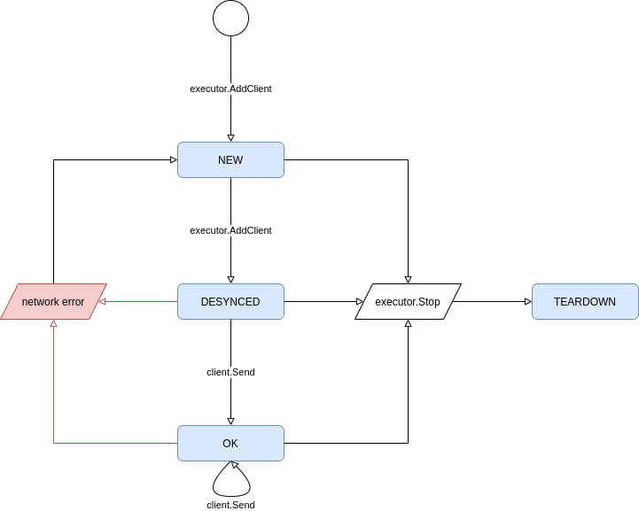

# Client Disconnect Handling in DownFlux
Client-Server Networking Model for a Large-Scale RTS

| Status         | draft                 |
| :------------- | :-------------------- |
| Author(s)      | minke.zhang@gmail.com |
| Contributor(s) |                       |
| Last Updated   | 2020-11-16            |

## Goals

* handle client reconnects
* resolve game state cleanly
* deal with connection spam
* detect client / server network outages

## Background

DownFlux is an ongoing open-source RTS game built from scratch (rather rashly).
Because DownFlux is not built on top of any existing _gaming_ engine, we need
to design a way for client-server network connections to be resilient to
network flakiness.

## Overview

Downflux is using a client-server model approach for networking, with gRPC
serving as the API layer. The client issues player commands (Move, Attack,
etc.) via blocking API, whereas the server passes game state change through a
persistent stream. During the normal course of a game, it is possible that the
client may experience transient network outages -- this design doc focuses on
one implementation of client disconnect / reconnect logic which can handle this
in a graceful and scalable way.

### StreamData API

The server communicates with the client via the `StreamData` RPC endpoint; each
message sent along this API contains a list of entities and a separate list of
curves, as well as the server time at which the message was generated. These
data points communicate the game state _delta_ between subsequent points in
time; by merging all data messages, the client will have the complete game
state.

These messages are sent once per server tick. To save on bandwidth, a message
will be sent only if a delta exists -- if both the list of entities and curve
deltas is empty, then the server will skip sending the message for that tick.

### Game State Monotonicity

The monotonically increasing[^1] game state _S_ may be totally represented by
the set _E_ of game entities and _C_ the set of curves representing game
metrics evolving over time. We represent the merging of an existing, valid
game state with an incoming StreamData message as

$$
S \prime := S \cup \Delta S = (E \cup \Delta E, C \cup \Delta C)
$$

The set of entities here is an _append-only_ mathematical set, i.e. there are
no duplicate elements. Because entities are uniquely identified by a UID, we
can send along just the newly generated entities per server tick.

A curve is uniquely specified by its

1. parent entity UID,
1. the entity property this curve represents (e.g. location, health, etc.),
1. and the last time the curve was updated by the server.

When we merge two curves, the data generated by the most recently-updated curve
takes precedence -- that is, if the older curve and newer curve have
conflicting extrapolated data, we replace the older curve's extrapolated data.
If the newer curve does not have information on a specific time interval, we
keep the older curve's data. In this way, we can guarantee that the curve
itself is idempotent under merge requests (of a specific destination curve),
and the prediction of the curve over time becomes more accurate (since we're
merging only new predictions).

We can formalize these definitions as 

$$
S \leq S \prime \iff E \subseteq E \prime \and C \leq C \prime
$$

We can compare the curves by comparing the server tick.

### Client Work

The game client will treat the incoming `StreamData` messages as game state
deltas and merge them into the local state via the process described above;
because the end user (player) of the client only cares about the current tick,
any data older than the current server tick may be thrown out[^2], and it's
okay if the old data is invalid.

Therefore, we can see a framework for leveraging the game state delta as a
game re-sync tool.

## Detailed Implementation

### Disconnect Detection

We can implement client / server disconnect detection via the gRPC
[`keepalive flags`](https://github.com/grpc/grpc/blob/master/doc/keepalive.md).
These may be specified on the server at start up time, and on the client at
connect time. gRPC supports heartbeat messages sent at specific intervals, and
allows the underlying channel to auto-close when a heartbeat timeout occurs.

Because this is handled at the gRPC layer, we may abstract that away in the
game `executor.Executor` instance, as long as we ensure that the gRPC server -
executor will always receive incoming `StreamDataResponse` messages, e.g. via a
server-local slice object per client.

#### Server

Once the client channel is closed, the client-side `StreamData` gRPC endpoint
will also terminate.

##### gRPC

The gRPC server on startup will set the flags specified in
[keepalive.md](https://github.com/grpc/grpc/blob/master/doc/keepalive.md) and
the [Golang module](https://pkg.go.dev/google.golang.org/grpc/keepalive) so
that

1. the client may periodically send keepalive messages;
1. the server _will_ send periodic keepalive messages; and
1. there is a definite, non-infinite timeout for these server-initiated
   keepalives, after which
   1. the gRPC stream will be closed, and
   1. the gRPC server will mark the underlying executor Client object as dirty,
      which then instructs the component to teardown the client channel and
      mark it as in need of a sync.

The gRPC server will implement a client-specific local message queue and
listener Goroutine -- these constructs will listen on the executor client
channel and enqueue any messages sent along it, guaranteeing that the channel
will never be blocked.

##### Executor

The executor will provide a `StopClientStreamError` function, which will be
used to teardown the client channel struct and mark the associated client as
out of sync with the game state.

###### Client State Metadata

The executor will model a client connection in the form of a transition
diagram --

The executor will keep an executor-specific client metadata object, with a flow
diagram as defined in [Figure 1](#figure-1). A metadata object
will store a Golang channel object, used to send data to the gRPC server.

<a name="figure-1">Figure 1</a>: Executor client flow diagram.

We are defining the states `NEW`, `DESYNCED`, `OK`, and `TEARDOWN` as follows:

* A client is in the `NEW` state when
  * the client is first created, or
  * when a network error is detected while streaming game state.

  In this state, the channel does not exist, and no data will be broadcasted to
  this client.
* A client enters the `DESYNCED` state once a call to the gRPC `StreamData`
  endpoint is made -- in this state, the channel is created, and the client is
  marked as needing the full game state update. The executor will provide the
  appropriate data upon the next tick to the client channel.
* A client is in the steady `OK` state once the full state has been sent.
  Future messages sent along this channel are state deltas, as defined above.
* A client enters the `TEARDOWN` state once the game shuts down -- at this
  point, the client may not reconnect, and the channel is permanently closed.

### Resync

With our flow diagram, it becomes apparent that the client upon a server
disconnect will only need to reissue a `StreamData` gRPC call with its stored
internal client ID. The gRPC server will handle the reconnect by marking the
client as `DESYNCED`, just as it would have done upon the initial stream
request. The next message sent from the server will be the full game state.

## Footnotes

[^1]: This is not necessarily the right wording, but there doesn't seem to be
     such a phrase which describes our game state assumptions.

[^2]: This is not true for the case of the replay client, but that should be
     connected to the server locally, where network flakiness is not an issue.
